# Component Strategy

## Design System Components

**MUI components used directly (no customization beyond theme):**

| MUI Component | DQS Usage | Views Used In |
|---------------|-----------|---------------|
| `Grid` | Page layout, card grid (3-col LOBs, responsive) | Summary, LOB Detail |
| `DataGrid` | Sortable dataset table with column headers | LOB Detail |
| `Breadcrumbs` | `Summary > LOB > Dataset` navigation path | All views (fixed header) |
| `TextField` + `Autocomplete` | Dataset search with inline score results | All views (fixed header) |
| `Chip` | Status badges (PASS/WARN/FAIL), check type labels | All views |
| `Card` + `CardContent` | Container for LOB cards, info panels, score breakdown | Summary, Dataset Detail |
| `Typography` | All text rendering with theme-defined scale | All views |
| `LinearProgress` | Score bars in breakdown panel | Dataset Detail |
| `ToggleButtonGroup` | Time range selector (7d/30d/90d) | All views (fixed header) |
| `List` + `ListItem` | Dataset list in Master-Detail left panel | Dataset Detail |
| `Table` | Check results list, simple data display | Dataset Detail |
| `Tooltip` | Hover details on truncated text, sparkline data points | All views |
| `IconButton` | Copy-to-clipboard for HDFS path | Dataset Detail |
| `Divider` | Section separators | All views |
| `Skeleton` | Loading states while data fetches | All views |

## Custom Components

### DqsScoreChip

**Purpose:** Display a DQS Score with color coding and trend indicator in a compact, reusable unit. This is the most frequently rendered component in the entire application — it appears in LOB cards, table rows, search results, dataset headers, and the left panel list.

**Anatomy:**
```
[Score Number] [Trend Arrow + Delta]
    87          ▲ +3
```

**Props:**

| Prop | Type | Description |
|------|------|-------------|
| `score` | number | DQS Score value (0-100) |
| `previousScore` | number? | Previous period score for delta calculation |
| `size` | `'lg'` \| `'md'` \| `'sm'` | Display size (lg=28px, md=18px, sm=14px) |
| `showTrend` | boolean | Whether to show trend arrow + delta (default: true) |

**States:**
- **Healthy** (score >= 80): Green text, up/flat arrow
- **Degraded** (score 60-79): Amber text, down/flat arrow
- **Critical** (score < 60): Red text, down arrow
- **No data**: Gray text, "—" instead of score
- **Loading**: MUI Skeleton placeholder

**Accessibility:** `aria-label="DQS Score 87, improving by 3 points"` — score, status, and trend communicated in a single label.

---

### DatasetCard (LOB Card)

**Purpose:** Display LOB-level health summary in the Summary Card Grid. Each card represents one Line of Business and shows aggregate quality metrics.

**Anatomy:**
```
┌─────────────────────────────┐
│ Consumer Banking             │
│ 18 datasets                  │
│                              │
│ 87  ▲ +3                     │
│ ████████████████████░░░      │
│ ┈┈┈╱╲┈┈┈╱╲┈┈ (sparkline)    │
│                              │
│ [16 pass] [1 warn] [1 fail]  │
└─────────────────────────────┘
```

**Props:**

| Prop | Type | Description |
|------|------|-------------|
| `lobName` | string | Line of business name |
| `datasetCount` | number | Total datasets in LOB |
| `dqsScore` | number | Aggregate LOB DQS Score |
| `previousScore` | number | Previous period score |
| `trendData` | number[] | Array of scores for sparkline |
| `statusCounts` | { pass, warn, fail } | Check status distribution |
| `onClick` | function | Navigation handler |

**States:**
- **Default:** Neutral border, white background
- **Hover:** Border transitions to `primary` color
- **Healthy LOB:** Score renders green via DqsScoreChip
- **Critical LOB:** Score renders red; optional subtle `error-light` left border accent
- **Loading:** MUI Skeleton for all content areas
- **No data:** "No data available" message, disabled click

**Interaction:** Click anywhere on card navigates to LOB Detail view.

**Accessibility:** `role="button"`, `aria-label="Consumer Banking, DQS Score 87, 18 datasets, 1 warning, 1 failure"`. Keyboard focusable, Enter/Space to activate.

---

### TrendSparkline

**Purpose:** Inline trend chart showing DQS Score over time. Rendered in LOB cards (medium), table rows (mini), and dataset detail (large).

**Anatomy:**
```
 ╱╲
╱  ╲  ╱╲
    ╲╱  ╲
```

**Props:**

| Prop | Type | Description |
|------|------|-------------|
| `data` | number[] | Array of score values over time |
| `size` | `'lg'` \| `'md'` \| `'mini'` | lg=64px tall, md=32px, mini=24px/80px wide |
| `color` | string? | Override color (default: derived from latest score threshold) |
| `showBaseline` | boolean | Show dashed baseline at threshold (default: false for mini) |

**Implementation:** Wraps Recharts `ResponsiveContainer` + `LineChart` with:
- No axes, no labels, no grid (sparkline only)
- Single stroke line, 1.5-2px width
- Color derived from latest data point's threshold (green/amber/red)
- Optional dashed horizontal baseline at score 80 (healthy threshold)
- Tooltip on hover shows date + score for that point (except `mini` size)

**States:**
- **Trending up:** Line color green
- **Trending down:** Line color matches current score threshold
- **Flat:** Line color from current threshold
- **Insufficient data:** Single dot or "—" placeholder
- **Loading:** Skeleton rectangle

**Accessibility:** `aria-label="Trend over 30 days, currently 87, was 84"` — summarizes direction without requiring visual interpretation.

---

### DatasetInfoPanel

**Purpose:** Display complete dataset metadata and source traceability in the Master-Detail right column. Critical for ops workflows where the next step is checking source data or escalating to source teams.

**Anatomy:**
```
┌─ DATASET INFO ──────────────┐
│ Source System:  CB10         │
│ LOB:           Commercial    │
│ Owner:         N/A           │
│ Format:        Parquet       │
│                              │
│ HDFS Path:                   │
│ /prod/abc/data/consumerzone/ │
│ src_sys_nm=cb10/             │
│ partition_date=20260330  [📋]│
│                              │
│ Parent Path:                 │
│ /prod/abc/data/consumerzone/ │
│                              │
│ Partition Date: 2026-03-30   │
│ Row Count:     4,201         │
│                (was 21,043)  │
│ Last Updated:  5:42 AM ET    │
│ Run ID:        #1847         │
│ Rerun #:       1             │
└─────────────────────────────┘
```

**Props:**

| Prop | Type | Description |
|------|------|-------------|
| `dataset` | DatasetInfo | Full dataset metadata object |

**DatasetInfo type:**

| Field | Type | Description |
|-------|------|-------------|
| `sourceSystem` | string | Lookup code (e.g., "CB10") |
| `lob` | string | Resolved LOB name (or "N/A") |
| `owner` | string | Resolved owner (or "N/A") |
| `format` | `'Avro'` \| `'Parquet'` | Data format |
| `hdfsPath` | string | Full HDFS path including partition |
| `parentPath` | string | Configured scan parent path |
| `partitionDate` | string | Date of the checked data |
| `rowCount` | number | Current row count |
| `previousRowCount` | number? | Previous row count for delta |
| `lastUpdated` | string | Timestamp of last DQS run |
| `runId` | string | Orchestration run reference |
| `rerunNumber` | number? | Rerun number if applicable |
| `errorMessage` | string? | Spark error message if job failed |

**Key interactions:**
- **HDFS path copy button:** `IconButton` with clipboard icon next to the path. Copies full path to clipboard. Tooltip confirms "Copied!" on click.
- **HDFS path display:** Monospace, selectable text. Word-breaks on `/` for readability. Full path always visible (no truncation).
- **Row count delta:** If `previousRowCount` exists and differs, shows "(was X)" in red/green based on direction.
- **Error message:** If present, displayed in a red-bordered alert box below the metadata. Human-readable error text, not stack traces.

**States:**
- **Normal:** All fields populated
- **Partial data:** "N/A" for unresolved reference data fields (LOB, owner)
- **Error state:** Error message box visible when Spark job failed
- **Loading:** Skeleton for all fields

**Accessibility:** Structured as a definition list (`dl`/`dt`/`dd`) for screen readers. HDFS path copy button has `aria-label="Copy HDFS path to clipboard"`.

## Component Implementation Strategy

**Build order aligned to user journeys:**

| Phase | Components | Enables |
|-------|-----------|---------|
| **Phase 1: Core** | `DqsScoreChip`, `TrendSparkline`, `DatasetCard` | Summary Card Grid (Level 1) — the landing page |
| **Phase 2: Table** | MUI `DataGrid` with custom cell renderers using Phase 1 components | LOB Detail table (Level 2) — dataset scanning |
| **Phase 3: Detail** | `DatasetInfoPanel`, score breakdown layout, check results list | Master-Detail Split (Level 3) — investigation |
| **Phase 4: Search** | MUI `Autocomplete` with custom option renderer using `DqsScoreChip` | Search-and-check flow — Alex's journey |

**Implementation principles:**
- All custom components are **compositions of MUI primitives** + theme tokens. No raw CSS except for Recharts sparkline styling.
- `DqsScoreChip` is built first because it's embedded in every other custom component (cards, tables, search results, detail views).
- Each phase produces a working view that can be validated independently before building the next level.
- Components use **TypeScript interfaces** for props — enforced types for score thresholds, dataset metadata, and trend data.

## Implementation Roadmap

```mermaid
gantt
    title Component Build Sequence
    dateFormat X
    axisFormat %s
    section Phase 1 - Landing
    DqsScoreChip        :p1a, 0, 1
    TrendSparkline       :p1b, 0, 1
    DatasetCard          :p1c, 1, 2
    Summary Card Grid    :p1d, 2, 3
    section Phase 2 - Table
    DataGrid cell renderers :p2a, 3, 4
    LOB Detail view        :p2b, 4, 5
    section Phase 3 - Detail
    DatasetInfoPanel     :p3a, 5, 6
    Score breakdown      :p3b, 5, 6
    Check results list   :p3c, 6, 7
    Master-Detail layout :p3d, 7, 8
    section Phase 4 - Search
    Search autocomplete  :p4a, 8, 9
    Fixed header bar     :p4b, 8, 9
```



Each phase delivers a testable vertical slice of the UI. Phase 1 alone produces the summary view that Priya and Marcus use most.
