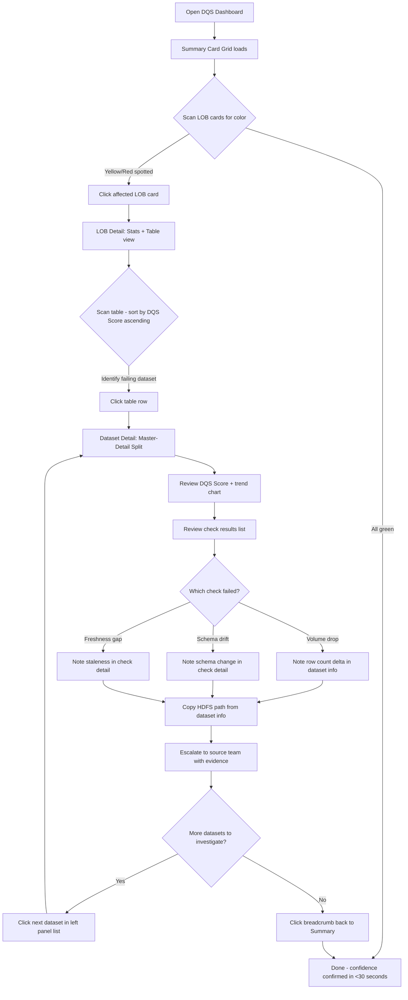
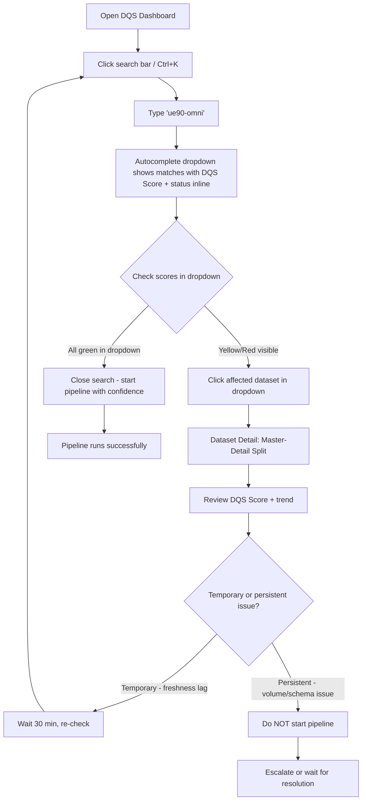
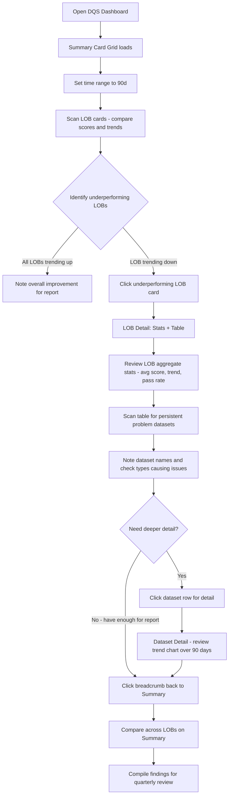
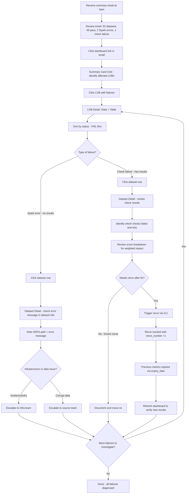
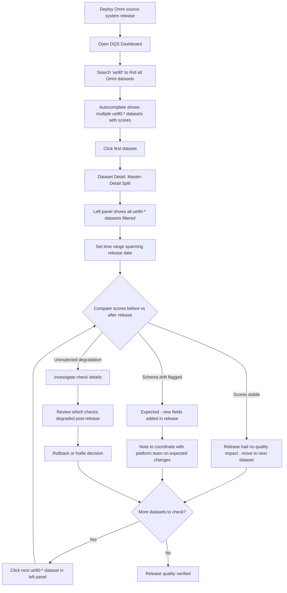

# User Journey Flows

## Journey 1: Priya (Data Steward) — Morning Triage

**Goal:** Assess overnight data quality across her LOB and identify issues before downstream consumers are impacted.

**Entry:** Bookmarked DQS URL -> Summary view (Card Grid)

**Key UX moments:**
- **30-second triage:** If all LOB cards are green, Priya is done. No clicks needed.
- **3-click investigation:** Summary card -> LOB table row -> Dataset detail. From landing to root cause in 3 clicks.
- **Left panel navigation:** Once in Master-Detail, Priya investigates multiple datasets without returning to the table — just clicks the next dataset in the left list.
- **HDFS path copy:** One-click copy of the full path enables immediate Slack message to source team with evidence.

## Journey 2: Alex (Downstream Consumer) — Pre-Pipeline Check

**Goal:** Verify that 3 specific datasets are healthy before kicking off the fraud analytics pipeline.

**Entry:** Search bar (available on any view)

**Key UX moments:**
- **5-second check:** Alex may never leave the search dropdown. If all 3 datasets show green scores inline, the check is done without navigating.
- **Score + status in dropdown:** The autocomplete shows DQS Score and status chip next to each result. This is the critical design detail — it eliminates the need to click through for quick checks.
- **Direct-to-detail:** If investigation is needed, clicking a search result lands on the exact same Master-Detail view as the drill-down path.

## Journey 3: Marcus (Executive) — Monthly Review

**Goal:** Assess data quality trends across LOBs for quarterly reporting and investment decisions.

**Entry:** Bookmarked DQS URL -> Summary view (Card Grid)

**Key UX moments:**
- **90-day time range:** Marcus's first action is changing the time toggle to 90d. All sparklines and trends update globally — one interaction changes the entire view.
- **LOB comparison on one screen:** The Card Grid with 3-4 LOB cards lets Marcus compare scores, trends, and status distributions side-by-side without scrolling.
- **Stops at LOB level:** Marcus typically doesn't drill to dataset detail. The LOB stats header (avg score + trend + pass rate) gives him enough for executive reporting. The table is there if he needs it.
- **Trend-first storytelling:** "Consumer Banking improved from 72 to 87 over 3 months" is readable directly from the LOB card sparkline and trend delta.

## Journey 4: Sas (Platform Ops) — Failure Diagnosis

**Goal:** Diagnose overnight run failures, identify root causes, and manage reruns.

**Entry:** Summary email link -> DQS Dashboard

**Key UX moments:**
- **Email -> Dashboard handoff:** Summary email contains dashboard link. One click from email to the relevant view.
- **Error message visibility:** For Spark errors (jobs that crashed), the error message is visible in the dataset info card — no log archaeology needed.
- **HDFS path for tracing:** Ops can copy the exact HDFS path to verify the source data directly, or include it in escalation messages.
- **Rerun awareness:** Dataset info shows run ID and rerun number. After triggering a rerun via CLI, refreshing the dashboard shows updated results with the new rerun number — audit trail visible in the UI.

## Journey 5: Deepa (Data Owner) — Post-Release Quality Check

**Goal:** Verify that a source system release didn't degrade data quality for her datasets.

**Entry:** Search bar or LOB table

**Key UX moments:**
- **Source system filtering via search:** Typing "ue90" surfaces all datasets from the Omni source system. The search doubles as a source system filter.
- **Left panel as filtered list:** After landing on one ue90 dataset, the left panel shows other ue90 datasets — Deepa can walk through all of them without re-searching.
- **Before/after comparison:** Setting the time range to span the release date lets Deepa see the trend line crossing the release boundary. Score changes are immediately visible in the sparkline.
- **Schema drift is expected context:** Deepa knows her team added new Avro fields. Seeing schema drift flagged confirms DQS is detecting the change — it's not a false alarm, it's a feature.

## Journey 6: LLM/MCP Consumer (Non-UI)

**Note:** This journey does not use the dashboard UI. The MCP tools consume the same REST API endpoints and return formatted text responses to natural language queries (e.g., "What failed last night?", "Show trending for dataset X"). The UX for this journey is the API response format and MCP tool design, not the dashboard layout. Covered in API design, not UX specification.

## Journey Patterns

**Common patterns across all UI journeys:**

| Pattern | Description | Used In |
|---------|-------------|---------|
| **Scan-for-color** | Visual scanning of color-coded scores to identify anomalies without reading numbers | Journeys 1, 3, 4 |
| **Search-to-score** | Type partial name, see DQS Score + status in autocomplete dropdown | Journeys 2, 5 |
| **Progressive drill** | Summary -> LOB -> Dataset, each level adding detail | Journeys 1, 3, 4 |
| **Left-panel walk** | Once in Master-Detail, navigate between datasets via left panel without backtracking | Journeys 1, 4, 5 |
| **Time-range shift** | Change global time selector to match the analysis window (7d for daily, 90d for quarterly) | Journeys 3, 5 |
| **Copy-and-escalate** | Copy HDFS path or dataset details for escalation to source/infra teams | Journeys 1, 4 |
| **Breadcrumb return** | Use breadcrumbs to jump back to any higher level after investigation | Journeys 1, 3, 4 |

## Flow Optimization Principles

1. **Shortest path to answer:** Every journey should reach its answer in the fewest possible interactions. Priya's triage is 0 clicks if green, 3 clicks to root cause if not. Alex's check is 0 clicks if green in search dropdown.

2. **No dead ends:** Every view leads somewhere. Every score is clickable. Every failed check provides context. Users never hit a wall where the next step is "go check the logs."

3. **Context preservation:** Drill-down never loses parent context. Breadcrumbs persist. The left panel in Master-Detail keeps sibling datasets visible. Users always know where they are and how to go back.

4. **Batch investigation:** The left-panel walk pattern lets users investigate multiple datasets in sequence without navigating back up the hierarchy. This optimizes for the common case where multiple datasets need attention in the same LOB.

5. **Exit velocity:** When the answer is "everything is fine," the UI communicates that in seconds (green cards, green search results) and gets out of the user's way. The goal isn't engagement — it's speed to confidence.
