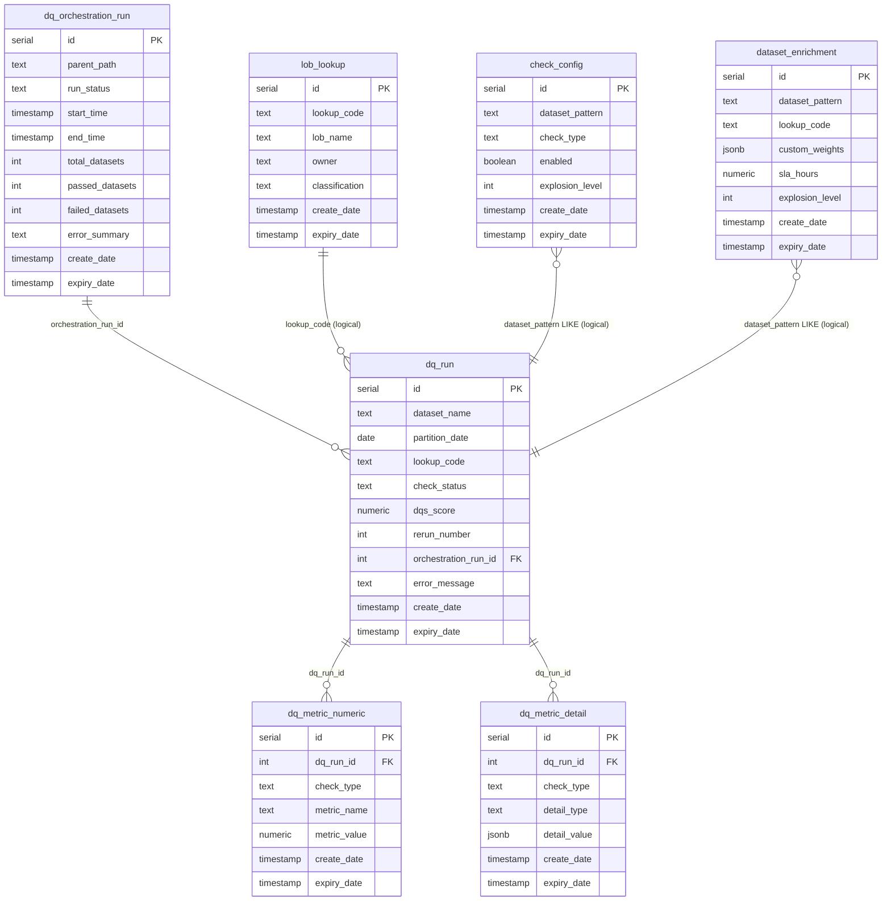

# Data Models

_Database schema documentation for the Data Quality Service. Schema DDL is owned by dqs-serve._

---

## Temporal Data Pattern

All tables use a **soft-delete temporal pattern** with two timestamp columns:

- `create_date` — Record creation timestamp (defaults to `NOW()`)
- `expiry_date` — Record expiry timestamp (defaults to `'9999-12-31 23:59:59'`)

**Active records** have `expiry_date = '9999-12-31 23:59:59'` (the `EXPIRY_SENTINEL` constant).

**Soft-delete** = update `expiry_date` from sentinel to current timestamp, then insert a new record with sentinel. Full audit history is preserved.

**Active-record views** (`v_*_active`) filter `WHERE expiry_date = '9999-12-31 23:59:59'`. The serve layer queries **only through these views**, never raw tables.

Each runtime defines `EXPIRY_SENTINEL` independently:
- Java: `DqsConstants.EXPIRY_SENTINEL`
- Python: `models.EXPIRY_SENTINEL`

---

## Entity Relationship Diagram

---

## Table Details

### dq_orchestration_run

One row per spark-submit invocation (per parent path per run).

| Column | Type | Constraints | Description |
|--------|------|-------------|-------------|
| id | SERIAL | PK | Auto-generated ID |
| parent_path | TEXT | NOT NULL | HDFS parent path (e.g., `lob=retail/src_sys_nm=alpha`) |
| run_status | TEXT | NOT NULL | `running`, `completed`, `completed_with_errors` |
| start_time | TIMESTAMP | | Job start time |
| end_time | TIMESTAMP | | Job end time |
| total_datasets | INTEGER | | Total datasets scanned |
| passed_datasets | INTEGER | | Datasets that passed |
| failed_datasets | INTEGER | | Datasets that failed |
| error_summary | TEXT | | Human-readable error summary |
| create_date | TIMESTAMP | NOT NULL, DEFAULT NOW() | Record creation |
| expiry_date | TIMESTAMP | NOT NULL, DEFAULT sentinel | Temporal pattern |

**Unique:** `(parent_path, expiry_date)`
**Index:** `idx_dq_orchestration_run_parent_path`
**Written by:** dqs-orchestrator (create/finalize)
**Read by:** dqs-serve (parent_path lookup), dqs-orchestrator (run summary)

---

### dq_run

One row per dataset per DQ run. Central fact table.

| Column | Type | Constraints | Description |
|--------|------|-------------|-------------|
| id | SERIAL | PK | Auto-generated ID (referenced as `dataset_id` in dashboard) |
| dataset_name | TEXT | NOT NULL | Full HDFS path (e.g., `lob=retail/src_sys_nm=alpha/dataset=sales_daily`) |
| partition_date | DATE | NOT NULL | Data partition date |
| lookup_code | TEXT | | LOB code (e.g., `LOB_RETAIL`) — resolved by EnrichmentResolver |
| check_status | TEXT | NOT NULL | `PASS`, `WARN`, `FAIL`, `NOT_RUN` — derived from DqsScoreCheck |
| dqs_score | NUMERIC(5,2) | | Composite quality score 0-100 |
| rerun_number | INTEGER | NOT NULL, DEFAULT 0 | 0=initial, 1+=rerun |
| orchestration_run_id | INTEGER | FK → dq_orchestration_run | Correlation to batch run |
| error_message | TEXT | | Error details if check failed |
| create_date | TIMESTAMP | NOT NULL, DEFAULT NOW() | |
| expiry_date | TIMESTAMP | NOT NULL, DEFAULT sentinel | |

**Unique:** `(dataset_name, partition_date, rerun_number, expiry_date)`
**Index:** `idx_dq_run_dataset_name_partition_date`
**Written by:** dqs-spark (BatchWriter)
**Read by:** dqs-serve (all API routes), dqs-orchestrator (rerun tracking)

---

### dq_metric_numeric

Numeric quality metrics. One row per metric per check per run.

| Column | Type | Constraints | Description |
|--------|------|-------------|-------------|
| id | SERIAL | PK | |
| dq_run_id | INTEGER | NOT NULL, FK → dq_run | Parent run |
| check_type | TEXT | NOT NULL | `FRESHNESS`, `VOLUME`, `SCHEMA`, `OPS`, `DQS_SCORE`, etc. |
| metric_name | TEXT | NOT NULL | e.g., `row_count`, `hours_since_update`, `null_rate`, `missing_columns` |
| metric_value | NUMERIC | | The measured value |
| create_date | TIMESTAMP | NOT NULL | |
| expiry_date | TIMESTAMP | NOT NULL | |

**Unique:** `(dq_run_id, check_type, metric_name, expiry_date)`
**Index:** `idx_dq_metric_numeric_dq_run_id`

---

### dq_metric_detail

Structured detail metrics stored as JSONB. Contains field names, thresholds, and status reasoning — **never source data values**.

| Column | Type | Constraints | Description |
|--------|------|-------------|-------------|
| id | SERIAL | PK | |
| dq_run_id | INTEGER | NOT NULL, FK → dq_run | Parent run |
| check_type | TEXT | NOT NULL | Check that produced this detail |
| detail_type | TEXT | NOT NULL | e.g., `eventAttribute_field_name`, `schema_hash`, `freshness_status` |
| detail_value | JSONB | | Supports all JSON types (string, number, boolean, array, object, nested) |
| create_date | TIMESTAMP | NOT NULL | |
| expiry_date | TIMESTAMP | NOT NULL | |

**Unique:** `(dq_run_id, check_type, detail_type, expiry_date)`
**Index:** `idx_dq_metric_detail_dq_run_id`

---

### check_config

Controls which checks are enabled per dataset pattern.

| Column | Type | Constraints | Description |
|--------|------|-------------|-------------|
| id | SERIAL | PK | |
| dataset_pattern | TEXT | NOT NULL | SQL LIKE pattern (e.g., `lob=retail/%`) |
| check_type | TEXT | NOT NULL | Check type to enable/disable |
| enabled | BOOLEAN | NOT NULL, DEFAULT TRUE | |
| explosion_level | INTEGER | NOT NULL, DEFAULT 0 | Check depth/granularity level |
| create_date | TIMESTAMP | NOT NULL | |
| expiry_date | TIMESTAMP | NOT NULL | |

**Unique:** `(dataset_pattern, check_type, expiry_date)`
**Index:** `idx_check_config_dataset_pattern`
**Read by:** dqs-spark (CheckFactory — reversed LIKE: `dataset_name LIKE dataset_pattern`)

---

### dataset_enrichment

Maps dataset patterns to LOB codes, custom weights, and SLA thresholds.

| Column | Type | Constraints | Description |
|--------|------|-------------|-------------|
| id | SERIAL | PK | |
| dataset_pattern | TEXT | NOT NULL | SQL LIKE pattern |
| lookup_code | TEXT | | LOB code (e.g., `LOB_RETAIL`) |
| custom_weights | JSONB | | Check type weights (e.g., `{"FRESHNESS":0.3,"VOLUME":0.3,...}`) |
| sla_hours | NUMERIC | | SLA deadline in hours |
| explosion_level | INTEGER | NOT NULL, DEFAULT 0 | |
| create_date | TIMESTAMP | NOT NULL | |
| expiry_date | TIMESTAMP | NOT NULL | |

**Unique:** `(dataset_pattern, expiry_date)`
**Index:** `idx_dataset_enrichment_dataset_pattern`
**Read by:** dqs-spark (EnrichmentResolver, SlaCountdownCheck)

---

### lob_lookup

Reference data for LOB metadata.

| Column | Type | Constraints | Description |
|--------|------|-------------|-------------|
| id | SERIAL | PK | |
| lookup_code | TEXT | NOT NULL | e.g., `LOB_RETAIL`, `LOB_COMMERCIAL` |
| lob_name | TEXT | NOT NULL | e.g., "Retail Banking" |
| owner | TEXT | NOT NULL | e.g., "Jane Doe" |
| classification | TEXT | NOT NULL | e.g., "Tier 1 Critical" |
| create_date | TIMESTAMP | NOT NULL | |
| expiry_date | TIMESTAMP | NOT NULL | |

**Unique:** `(lookup_code, expiry_date)`
**Index:** `idx_lob_lookup_lookup_code`
**Read by:** dqs-serve (ReferenceDataService — 12h TTL cache)

---

## Active-Record Views

All views filter `WHERE expiry_date = '9999-12-31 23:59:59'`:

| View | Source Table |
|------|-------------|
| `v_dq_orchestration_run_active` | `dq_orchestration_run` |
| `v_dq_run_active` | `dq_run` |
| `v_dq_metric_numeric_active` | `dq_metric_numeric` |
| `v_dq_metric_detail_active` | `dq_metric_detail` |
| `v_check_config_active` | `check_config` |
| `v_dataset_enrichment_active` | `dataset_enrichment` |
| `v_lob_lookup_active` | `lob_lookup` |

---

## Test Fixtures

Location: `dqs-serve/src/serve/schema/fixtures.sql`

Execution order: `ddl.sql` → `views.sql` → `fixtures.sql`

The fixtures provide a realistic baseline for development and testing:

| Data | Details |
|------|---------|
| Orchestration runs | 2 runs (retail/alpha COMPLETE_WITH_ERRORS, commercial/beta COMPLETE_WITH_ERRORS) |
| DQ runs | 7-day baseline for `sales_daily` (all PASS, score 98.50), 5 additional datasets with mixed statuses |
| Legacy path | `src_sys_nm=omni/dataset=customer_profile` (no `lob=` prefix) |
| Volume metrics | 7-day row_count series (96k-107k range) for anomaly detection baseline |
| Freshness metrics | 2h (healthy), 72h (stale) |
| Schema metrics | 3 missing columns (FAIL) |
| OPS metrics | 87% null rate (WARN) |
| Detail metrics | All 6 JSONB literal types (string, number, boolean, array, object, nested) |
| LOB lookups | LOB_RETAIL, LOB_COMMERCIAL, LOB_LEGACY |
| Check configs | 4 patterns (wildcard, specific disable, non-zero explosion_level) |
| Dataset enrichment | 3 patterns with custom_weights JSONB and SLA hours |
