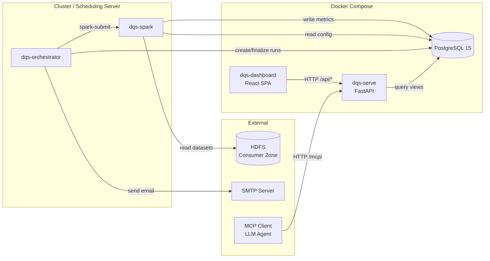

# Integration Architecture

_How the 4 components of the Data Quality Service communicate._

---

## Communication Model

Components communicate **exclusively through PostgreSQL**. There is no direct HTTP, RPC, or message queue between backend components. The only HTTP communication is dashboard → serve (API calls).



---

## Integration Points

### 1. dqs-orchestrator → dqs-spark (spark-submit)

| Attribute | Value |
|-----------|-------|
| Type | Process invocation (subprocess) |
| Protocol | spark-submit CLI |
| Direction | Orchestrator spawns Spark jobs |
| Frequency | One spark-submit per parent path per run |
| Parameters | `--parent-path`, `--date`, `--orchestration-run-id`, `--rerun-number`, `--datasets` |
| Timeout | 600 seconds |
| Failure handling | Per-path isolation — failed path logged, other paths continue |

### 2. dqs-spark → PostgreSQL (JDBC writes)

| Attribute | Value |
|-----------|-------|
| Type | Database (JDBC) |
| Protocol | PostgreSQL wire protocol |
| Direction | Spark writes metrics; reads config |
| Tables written | `dq_run`, `dq_metric_numeric`, `dq_metric_detail` |
| Tables/views read | `check_config`, `v_dataset_enrichment_active`, `dq_metric_numeric` (historical baselines), `dq_metric_detail` (schema baselines) |
| Transaction model | Single transaction per dataset per parent path (BatchWriter) |
| Connection | `jdbc:postgresql://localhost:5432/postgres` (config/application.properties) |

### 3. dqs-orchestrator → PostgreSQL (psycopg2)

| Attribute | Value |
|-----------|-------|
| Type | Database (psycopg2) |
| Direction | Orchestrator creates/finalizes runs; expires metrics on rerun |
| Tables written | `dq_orchestration_run` (create/finalize) |
| Tables updated | `dq_run`, `dq_metric_numeric`, `dq_metric_detail` (expire on rerun) |
| Tables read | `dq_orchestration_run`, `dq_run`, `dq_metric_detail` (run summary for email) |
| Transaction model | Atomic expire: 3 UPDATEs in single transaction |

### 4. dqs-serve → PostgreSQL (SQLAlchemy 2.0)

| Attribute | Value |
|-----------|-------|
| Type | Database (SQLAlchemy) |
| Direction | Read-only (serve never writes metrics) |
| Views queried | All 7 `v_*_active` views |
| Connection pool | 5 connections, max overflow 10 |
| Query style | `text()` with named parameters, `.mappings().all()` |

### 5. dqs-dashboard → dqs-serve (HTTP API)

| Attribute | Value |
|-----------|-------|
| Type | HTTP REST |
| Protocol | JSON over HTTP |
| Direction | Dashboard fetches data from serve |
| Base URL | `/api` (proxied via Vite to `http://localhost:8000`) |
| Caching | TanStack Query (stale-while-revalidate) |
| Endpoints | `/api/summary`, `/api/lobs`, `/api/lobs/{id}/datasets`, `/api/datasets/{id}`, `/api/datasets/{id}/metrics`, `/api/datasets/{id}/trend`, `/api/search`, `/api/executive/report` |

### 6. MCP Client → dqs-serve (FastMCP)

| Attribute | Value |
|-----------|-------|
| Type | MCP over HTTP |
| Mount point | `/mcp/` |
| Tools | `query_failures`, `query_dataset_trend`, `compare_lob_quality` |
| Response format | Plain text (LLM-optimized, not JSON) |

### 7. dqs-orchestrator → SMTP (email)

| Attribute | Value |
|-----------|-------|
| Type | SMTP |
| Direction | Orchestrator sends summary emails |
| Trigger | After all spark-submit jobs complete |
| Content | Run summary with failure categorization + rerun commands |
| Failure handling | Non-fatal (SMTP errors logged, never affect exit code) |

---

## Data Flow

```
1. Orchestrator creates orchestration_run records in PostgreSQL
        ↓
2. Orchestrator invokes spark-submit (one per parent path)
        ↓
3. Spark scans HDFS consumer zone for datasets at partition date
        ↓
4. Spark reads check_config + dataset_enrichment from PostgreSQL
        ↓
5. Spark executes enabled checks per dataset (strategy pattern)
        ↓
6. Spark writes dq_run + dq_metric_numeric + dq_metric_detail to PostgreSQL
        ↓
7. Orchestrator finalizes orchestration_run with pass/fail counts
        ↓
8. Orchestrator sends summary email via SMTP
        ↓
9. Serve reads v_*_active views and serves API responses
        ↓
10. Dashboard fetches /api/* endpoints and renders SPA
```

---

## Dependency Chain

**Unidirectional:** Schema → Spark + Orchestrator → Serve → Dashboard + MCP

```
dqs-serve/schema/ddl.sql          (schema definition — source of truth)
        ↓
dqs-spark + dqs-orchestrator      (write/update data)
        ↓
dqs-serve                         (read-only API layer)
        ↓
dqs-dashboard + MCP clients       (consume API)
```

No circular dependencies. No component imports from or calls another directly (except dashboard → serve via HTTP).

---

## Shared Patterns Across Components

| Pattern | Java (dqs-spark) | Python (dqs-serve) | Python (dqs-orchestrator) | TypeScript (dqs-dashboard) |
|---------|-------------------|---------------------|---------------------------|--------------------------|
| EXPIRY_SENTINEL | `DqsConstants.EXPIRY_SENTINEL` | `models.EXPIRY_SENTINEL` | Inline constant in db.py | N/A (API handles) |
| DB connection | JDBC (application.properties) | SQLAlchemy (DATABASE_URL env) | psycopg2 (orchestrator.yaml) | N/A |
| snake_case flow | Postgres columns | Python vars + JSON keys | Python vars | Consumes as-is from API |
| run_id correlation | Written to dq_run | Read from v_dq_run_active | Passed via --orchestration-run-id | Displayed in DatasetInfoPanel |
| Timezone | Eastern (native) | Eastern (native) | Eastern (native) | Displays as-is |

---

## Docker Compose Topology

```yaml
services:
  postgres:     # Port 5432, Postgres 15
  serve:        # Port 8000, depends_on: postgres
  dashboard:    # Port 5173, depends_on: serve
```

**Not in Docker Compose:** dqs-spark (runs on Spark cluster), dqs-orchestrator (runs on scheduling server). Both connect to the same PostgreSQL instance externally.
