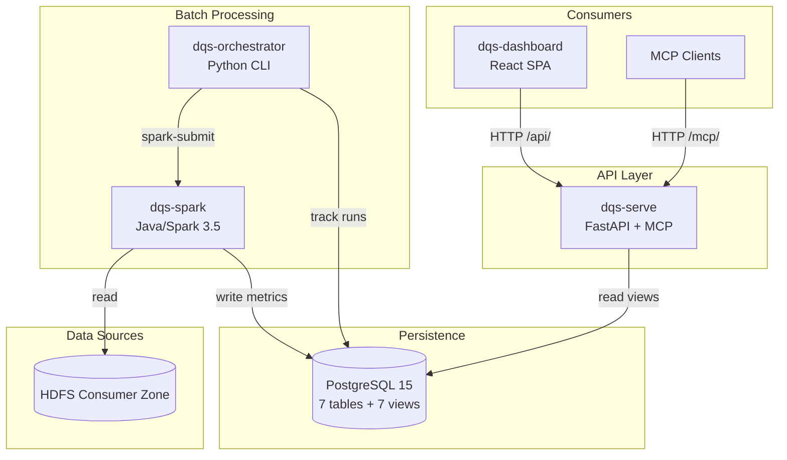

# Project Overview

_Data Quality Service — a multi-component platform for automated data quality monitoring._

---

## Purpose

The Data Quality Service (DQS) automates data quality monitoring for datasets stored in HDFS. It scans datasets daily, runs configurable quality checks (freshness, volume, schema drift, operational anomalies), computes composite quality scores, and presents results through a web dashboard and MCP tools for LLM integration.

---

## Architecture Summary

DQS is a **monorepo with 4 self-contained components**, designed to be split into independent repos without changes.

---

## Technology Stack

| Component | Runtime | Framework | Key Dependencies |
|-----------|---------|-----------|-----------------|
| **dqs-spark** | Java 17 | Spark 3.5.0 (provided) | PostgreSQL JDBC 42.7.2, Jackson 2.15.4, JUnit 5.10.2 |
| **dqs-serve** | Python 3.12+ | FastAPI 0.135+ | SQLAlchemy 2.0.48, FastMCP 3.2.0, Pydantic 2, uvicorn |
| **dqs-orchestrator** | Python 3.12+ | CLI (argparse) | psycopg2-binary, PyYAML |
| **dqs-dashboard** | TypeScript 5.9 | React 19, Vite 8 | MUI 7.3.9, TanStack Query 5, Recharts 3.8, React Router 7 |
| **Infrastructure** | | Docker Compose | PostgreSQL 15, single instance |

---

## Component Responsibilities

### dqs-spark — Data Quality Checks

The Spark component scans HDFS datasets and runs quality checks using a **strategy pattern** (16 check types across 3 tiers). New checks require only a new Java class + factory registration + check_config row — zero changes to serve/API/dashboard.

- **Tier 1** (Foundational): Freshness, Volume, Schema, Ops
- **Tier 2** (Extended): SLA Countdown, Zero Row, Breaking Change, Distribution, Timestamp Sanity
- **Tier 3** (Intelligence): Classification Weighted, Source System Health, Correlation, Inferred SLA, Lineage, Orphan Detection, Cross Destination
- **Composite**: DQS Score (weighted 0-100 from Tier 1 checks, runs last)

### dqs-serve — API and Schema Owner

The FastAPI component provides REST endpoints and MCP tools for querying quality data. It **owns the PostgreSQL schema DDL** — all schema changes go through this component.

- 9 REST endpoints (summary, LOBs, datasets, metrics, trends, search, executive report)
- 3 MCP tools (query_failures, query_dataset_trend, compare_lob_quality)
- ReferenceDataService with 12h TTL cache for LOB lookups
- Read-only (never writes DQ metrics)

### dqs-orchestrator — Job Orchestration

The Python CLI manages spark-submit invocations with per-path failure isolation, run tracking, rerun management with metric expiration, and summary email notifications.

### dqs-dashboard — Visualization

The React SPA provides a 3-level drill-down (Summary → LOB → Dataset) plus executive reporting. Uses TanStack Query for data fetching, MUI 7 design system, skeleton loading (no spinners), and full accessibility support.

---

## Key Design Patterns

| Pattern | Scope | Description |
|---------|-------|-------------|
| **Temporal soft-delete** | All components | `create_date` + `expiry_date` with sentinel value; active-record views |
| **Strategy + Factory** | dqs-spark | Pluggable check implementations via DqCheck interface + CheckFactory |
| **Shared-nothing** | All components | Components communicate only through PostgreSQL; no direct calls |
| **Schema DDL ownership** | dqs-serve | Single owner for all Postgres schema — prevents drift |
| **Stale-while-revalidate** | dqs-dashboard | TanStack Query for optimistic UI updates |
| **Per-dataset failure isolation** | dqs-spark | One dataset failure never crashes the JVM |
| **Per-path failure isolation** | dqs-orchestrator | One failed parent path never halts others |

---

## Repository Structure

| Directory | Status | Description |
|-----------|--------|-------------|
| `dqs-spark/` | Active | Java/Maven Spark checks |
| `dqs-serve/` | Active | Python/FastAPI API + MCP + schema |
| `dqs-orchestrator/` | Active | Python CLI orchestrator |
| `dqs-dashboard/` | Active | React/TypeScript SPA |
| `tests/` | Active | Workspace-level acceptance tests |
| `_bmad-output/` | Reference | Planning artifacts (PRD, architecture, UX spec, epics) |
| `spark-job/` | Archived | Prototype Spark code (~15-20% implementation) |
| `serve-api/` | Archived | Prototype API code |
| `db/` | Archived | Outdated schema init script |

---

## Quick Links

- [Source Tree Analysis](./source-tree-analysis.md)
- [Data Models](./data-models.md)
- [API Contracts](./api-contracts.md)
- [Integration Architecture](./integration-architecture.md)
- [Development Guide](./development-guide.md)
